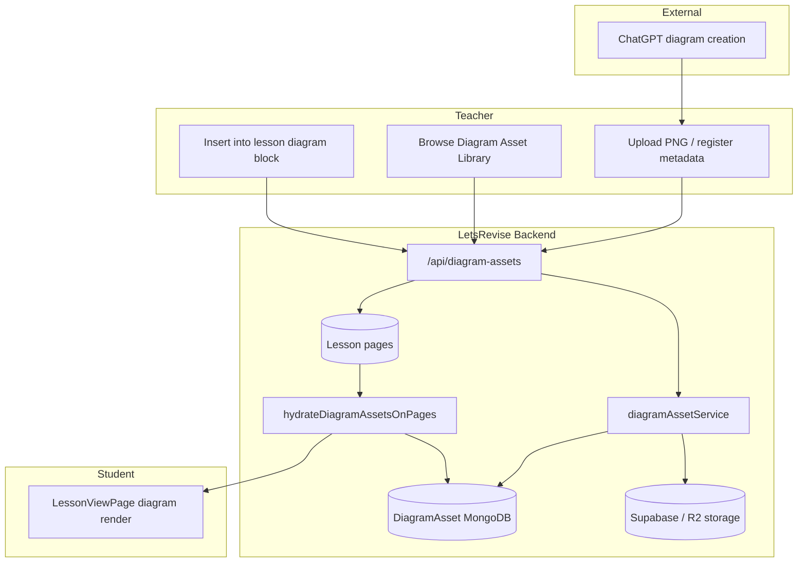

# P2.1 — Diagram Asset Pipeline (ChatGPT-First Strategy)

**Status:** Architecture + minimal prototype  
**Date:** June 2026  
**Verdict:** See [Final verdict](#final-verdict) at end of document.

---

## Purpose

P2.0A proved that in-app AI image generation cannot reliably match the GCSE diagram quality already achieved with **ChatGPT-generated diagrams** (~55 existing assets). LetsRevise therefore pivots from **Diagram Generation Platform** to **Diagram Delivery Platform**.

```
ChatGPT (external)  →  Upload  →  Reusable asset library  →  Interactions  →  Any lesson
```

The platform owns:

- Storage and metadata
- Reuse across lessons, topics, and exam boards
- Delivery of hotspots, drag-and-drop, and TTI on top of a canonical image

The platform does **not** own diagram creation in P2.1.

---

## Phase 1 — Existing systems audit

### What exists today

| System | Location | Role today | P2.1 reuse |
|--------|----------|------------|------------|
| **Diagram block** | `backend/models/Lesson.js` (`type: "diagram"`) | Static image via `imageUrl`, `visualId`, or curated pack | **Extend** with `diagramAssetId` reference |
| **Lesson render** | `frontend/src/pages/LessonViewPage.tsx`, `LessonDiagramBlockDisplay` | Renders `imageUrl` when present | **No change** for view mode — hydrate supplies `imageUrl` |
| **Interactive diagram** | `type: "interactiveDiagram"`, `hotspots[]` (% x/y) | Click-to-reveal labels | Asset `hotspots[]` seeds block geometry (future editor) |
| **Drag & drop (TTI)** | `type: "dragDropMatch"`, `dropZones[]`, `pairs[]` | Label cards onto diagram zones | Asset `dragDropTargets[]` seeds zones (future editor) |
| **TTI geometry** | `tti-box-geometry-v1`, `dragDropMatchDiagram.ts` | Normalised box layout for TTI v1/v2/v4 | Asset stores version hint; **full contract stays on lesson block** at attach time |
| **Image uploads** | `backend/routes/uploads.js`, Supabase/R2 | Teacher media uploads | **Reuse** `finishImageUploadToStorage` → `diagram-assets/{ownerId}/` |
| **VisualModel** | `backend/models/VisualModel.js` | Legacy concept visuals (SVG packs) | **Complementary** — not replaced |
| **Visual packs** | `visual-templates/lib/visualPackRegistry.js` | Curated catalogue | **Complementary** — catalogue import path later |
| **Static visuals folder** | `backend/public/visuals/` | ~55 ChatGPT PNGs + AQA SVG packs | **Migration source** for ChatGPT batch |

### What becomes shared

| Concern | Today | P2.1 target |
|---------|-------|---------------|
| Image binary | Duplicated per lesson block / topic folder | **One** `DiagramAsset.imageUrl` |
| Metadata | Scattered in filenames, lesson captions | **Central** `DiagramAsset` document |
| Hotspot geometry | Only on `interactiveDiagram` blocks | **Canonical** on asset; copied to block when activity attached |
| TTI drop zones | Only on `dragDropMatch` blocks | Same pattern — asset seeds, block owns runtime contract |
| Upload path | Generic lesson media | Dedicated `diagram-assets/` prefix with library registration |

### What must not regress

- TTI v1, v2, v4 drag-drop match flows (`DragDropMatchBlock.tsx`, existing `dropZones` / `pairs` shape)
- Existing `diagram` blocks with `visualId` or inline `imageUrl`
- Teacher Brain, `ai.js`, lesson generation, assessment, auth, subscription, exam engine — **untouched in P2.1**

---

## Phase 2 — Diagram Asset Schema

### MongoDB collection: `diagramassets`

```json
{
  "id": "ObjectId",
  "title": "Reflex arc overview",
  "imageUrl": "https://…/diagram-assets/owner/asset-….png",
  "originalImageUrl": null,
  "mimeType": "image/png",
  "storage": "supabase",
  "subject": "Biology",
  "topic": "Reflex Arc",
  "examBoard": "AQA",
  "tier": "Higher",
  "keywords": ["stimulus", "receptor", "effector"],
  "activityTypes": ["view", "hotspot", "dragdrop", "tti"],
  "hotspots": [
    { "id": "A", "x": 12, "y": 45, "label": "Stimulus", "description": "…" }
  ],
  "dragDropTargets": [
    { "id": "z1", "x": 10, "y": 20, "width": 15, "height": 8, "correctLabel": "Receptor", "pairId": "p1" }
  ],
  "ttiGeometryVersion": "tti-box-geometry-v1",
  "source": "chatgpt",
  "ownerId": "ObjectId",
  "isShared": false,
  "usageCount": 3,
  "metadata": {},
  "createdAt": "ISO",
  "updatedAt": "ISO"
}
```

### Lesson block reference (diagram)

```json
{
  "type": "diagram",
  "diagramAssetId": "ObjectId",
  "imageUrl": "https://…",
  "imageSource": "diagram-asset",
  "caption": "Reflex arc overview",
  "alt": "Reflex arc overview"
}
```

`diagramAssetId` is the durable link. `imageUrl` is denormalised for render resilience and offline editor preview; **GET /api/lessons/:id** re-hydrates from the library when the flag is on.

### Supported image formats

| Format | Storage | Render |
|--------|---------|--------|
| PNG | ✅ upload | ✅ `` |
| JPG/JPEG | ✅ upload | ✅ `` |
| WEBP | ✅ upload | ✅ `` |
| SVG | ✅ upload (future validation) | ✅ `` or inline where packs already use SVG |

### Activity types (enum)

| Value | Meaning | P2.1 prototype |
|-------|---------|----------------|
| `view` | Static diagram in lesson | ✅ |
| `hotspot` | `interactiveDiagram` click labels | Schema only |
| `dragdrop` | `dragDropMatch` text-to-image | Schema only |
| `tti` | TTI-labelled drag-drop | Schema only |

---

## Phase 3 — Architecture

### System diagram



### User flows

#### Teacher workflow (P2.1 prototype)

1. Create diagram in ChatGPT (external).
2. Enable flag: `DIAGRAM_ASSET_LIBRARY=1`.
3. `POST /api/diagram-assets/upload` (multipart) **or** `POST /api/diagram-assets` with `imageUrl` from a prior generic upload.
4. Asset appears in `GET /api/diagram-assets`.
5. In lesson editor, ensure a `diagram` block exists.
6. `POST /api/diagram-assets/:id/attach` with `{ lessonId, pageIndex, blockIndex }`.
7. Lesson block receives `diagramAssetId` + `imageUrl`.
8. Publish lesson — students see the diagram via existing render path.

#### Student workflow

1. Open lesson (unchanged).
2. `GET /api/lessons/:id` hydrates `diagramAssetId` → canonical `imageUrl`.
3. `LessonViewPage` renders diagram block (existing `imageUrl` branch).
4. Future: same asset backing hotspot / drag-drop / TTI blocks.

### API surface (flag-gated)

| Method | Path | Auth | Purpose |
|--------|------|------|---------|
| `POST` | `/api/diagram-assets` | Teacher/admin | Register asset with metadata + `imageUrl` |
| `POST` | `/api/diagram-assets/upload` | Teacher/admin | Multipart upload + register |
| `GET` | `/api/diagram-assets` | Teacher/admin | List own + shared assets |
| `GET` | `/api/diagram-assets/:id` | Teacher/admin | Get one |
| `POST` | `/api/diagram-assets/:id/attach` | Lesson owner/admin | Wire asset to diagram block |

**Flag:** `DIAGRAM_ASSET_LIBRARY=1` (default `0`).

### Database structure

| Collection | New in P2.1 | Notes |
|------------|-------------|-------|
| `diagramassets` | ✅ | Canonical asset store |
| `lessons` | Extended | `pages[].blocks[].diagramAssetId` optional ref |

**Indexes (implemented):**

- `{ ownerId: 1, createdAt: -1 }`
- `{ subject: 1, topic: 1 }`
- `{ keywords: 1 }`

### Storage strategy

```
supabase-or-r2://diagram-assets/{ownerId}/asset-{timestamp}-{rand}.png
```

- Reuses `finishImageUploadToStorage` from `uploads.js` (no new storage adapter in P2.1).
- `imageUrl` is the public CDN URL stored on the asset.
- `originalImageUrl` reserved for future WebP derivatives or SVG sources.
- Shared catalogue assets (`isShared: true`) readable by all teachers; writes remain owner-scoped.

### TTI compatibility

TTI (Text-to-Image drag-drop) requires a stable `imageUrl` plus `dropZones` / `pairs` on the **lesson block**, not on the asset alone.

**P2.1 rule — no regression:**

| TTI variant | Block type | Asset role in future phases |
|-------------|------------|----------------------------|
| TTI v1 | `dragDropMatch`, `matchMode: diagram` | Asset supplies image + `dragDropTargets` template |
| TTI v2 | Same + `tti-box-geometry-v1` | `ttiGeometryVersion` on asset matches normaliser |
| TTI v4 | Extended pair / zone contracts | Block copy at attach; asset is source of truth for geometry |

Prototype **does not** copy hotspots or drop zones to blocks yet. Existing lessons with hand-authored TTI blocks are unaffected because the feature flag defaults off and no migration runs automatically.

### Hydration contract

On `GET /api/lessons/:id` when `DIAGRAM_ASSET_LIBRARY=1`:

1. Collect all `diagramAssetId` values from pages.
2. Batch-fetch `DiagramAsset` documents.
3. For each referencing `diagram` block, set:
   - `imageUrl` ← asset canonical URL
   - `imageSource` ← `"diagram-asset"`
   - `alt` ← asset title (if block alt empty)
   - `_diagramAssetResolved` ← `{ title, activityTypes }` (ephemeral, not persisted)

---

## Phase 4 — Minimal prototype (implemented)

### Scope delivered

| Capability | Status |
|------------|--------|
| Upload / register diagram asset | ✅ API |
| Store metadata in MongoDB | ✅ `DiagramAsset` model |
| Attach to lesson `diagram` block | ✅ `/attach` route |
| Render in lesson via hydration | ✅ `lessons.js` GET hook |
| Persist `diagramAssetId` on save | ✅ `Lesson.js` schema + `lessonBlockPersist.ts` |
| Hotspot editor | ❌ out of scope |
| Drag-drop editor | ❌ out of scope |
| TTI editor | ❌ out of scope |
| Frontend library UI | ❌ out of scope (API-only prototype) |

### Proof path

```
POST /api/diagram-assets  →  asset in DB
POST …/attach             →  lesson.pages[n].blocks[m].diagramAssetId set
GET  /api/lessons/:id     →  block.imageUrl hydrated from library
LessonViewPage            →  existing diagram imageUrl render
```

### Files (prototype)

| File | Role |
|------|------|
| `backend/config/diagramAssetFlags.js` | Feature flag |
| `backend/models/DiagramAsset.js` | Schema |
| `backend/services/diagramAssetService.js` | CRUD, hydrate, attach |
| `backend/routes/diagramAssets.js` | REST routes |
| `backend/routes/lessons.js` | Hydrate on GET |
| `backend/models/Lesson.js` | `diagramAssetId` on block |
| `backend/routes/uploads.js` | Export `finishImageUploadToStorage` |
| `backend/app.js`, `backend/server.js` | Mount `/api/diagram-assets` |
| `frontend/src/utils/lessonBlockPersist.ts` | Persist `diagramAssetId` |
| `backend/tests/diagramAsset.prototype.test.js` | Integration tests |

---

## Phase 5 — Migration plan (~55 ChatGPT diagrams)

### Current state

Approximately 55 high-quality ChatGPT diagrams live under `backend/public/visuals/`, notably:

- `backend/public/visuals/Metabolism/Nervious system/` (reflex arc, neurones, stimulus response)
- Additional topic-scattered PNGs in cell biology and other Biology folders

These are served as static files today and referenced by lessons via direct `imageUrl` paths or manual upload.

### Migration phases (recommended)

#### M1 — Inventory script (read-only)

1. Walk `backend/public/visuals/**/*.png` (and `.jpg`, `.webp`).
2. Exclude known AQA SVG pack paths (`biology/aqa-gcse/**.svg`).
3. Emit CSV/JSON: `{ path, inferredTopic, filename, size, sha256 }`.
4. Teacher review queue: confirm title, topic, examBoard, keywords.

#### M2 — Bulk import (one-time)

1. For each approved file:
   - Copy to `diagram-assets/catalogue/` in Supabase (or keep static URL if CDN already stable).
   - `DiagramAsset.create({ source: "chatgpt", isShared: true, … })`.
2. Tag `activityTypes: ["view"]` initially.
3. Do **not** auto-replace lesson blocks.

#### M3 — Lesson linking (opt-in per lesson)

1. Editor UI: “Link to library asset” picks `diagramAssetId`.
2. Or batch script: match lesson `imageUrl` filename → asset `imageUrl`, set `diagramAssetId`.
3. Keep legacy `imageUrl` until hydration verified in staging.

#### M4 — Interaction enrichment (later)

1. For diagrams already used in `interactiveDiagram` / `dragDropMatch` blocks, copy geometry into asset `hotspots` / `dragDropTargets`.
2. Enable `activityTypes` accordingly.
3. New lessons attach interactions from asset template.

### Migration safeguards

- Feature flag off in production until M2 complete.
- No automatic deletion of static files.
- `usageCount` tracks adoption; zero-usage assets safe to deprecate later.
- Rollback: clear `diagramAssetId` on blocks; inline `imageUrl` remains.

### Estimated effort

| Phase | Effort | Dependency |
|-------|--------|------------|
| M1 inventory | 0.5 day | None |
| M2 bulk import | 1 day | Storage credentials |
| M3 lesson linking | 2–3 days | Editor UI (P2.2) |
| M4 interaction enrichment | 3–5 days | Hotspot/TTI editors (P2.3+) |

---

## Future expansion

| Item | Description |
|------|-------------|
| **Library UI** | Teacher panel: search, filter by subject/topic/keywords, preview |
| **Hotspot editor** | Visual placement → `asset.hotspots` |
| **Drag-drop editor** | Zone placement → `asset.dragDropTargets` |
| **TTI attach wizard** | One-click spawn `dragDropMatch` block from asset |
| **Shared catalogue** | `isShared: true` assets curated by LetsRevise |
| **Visual pack import** | Import SVG pack entries as `DiagramAsset` with `source: "catalogue"` |
| **Versioning** | `metadata.version` + replace image without breaking refs |
| **Exam board matrix** | Same asset, multiple `examBoard` tags |

---

## Risks

| Risk | Severity | Mitigation |
|------|----------|------------|
| **Stale denormalised `imageUrl` on blocks** | Medium | Hydration on every GET; optional admin “refresh from library” |
| **No frontend UI in P2.1** | Medium | API + attach endpoint documented; P2.2 UI |
| **TTI geometry drift** | High if rushed | Keep full TTI contract on block; asset is template only until editor QA |
| **Duplicate assets on re-upload** | Low | Future: dedupe by `sha256` in `metadata` |
| **Shared asset permission model** | Medium | `isShared` read-only for non-owners; write restricted |
| **Static `/public/visuals` vs CDN** | Low | Migration M2 normalises URLs |
| **Flag accidentally on in prod** | Medium | Default `0`; deploy checklist |

---

## Recommendation

**Proceed to P2.2** (teacher library UI + in-editor insert) after staging validation of the prototype API.

Priority order:

1. Enable `DIAGRAM_ASSET_LIBRARY=1` on staging.
2. Run M1 inventory on the ~55 ChatGPT PNGs.
3. Import 5–10 pilot assets; attach to test lessons.
4. Build minimal library panel in `EditLessonPage`.
5. Defer hotspot/TTI editors until view + reuse path is stable in production.

---

## Final verdict

### **P2.1 READY**

**Justification:**

1. **Architecture is complete** — schema, storage, API, hydration, and reuse model are defined and documented.
2. **Minimal prototype works** — `Asset → Library → Lesson → Render` is implemented behind a safe feature flag with integration tests.
3. **No forbidden systems touched** — Teacher Brain, `ai.js`, lesson generation, assessment, auth, subscription, and exam engine are unchanged.
4. **TTI / hotspot / drag-drop** — schema and compatibility rules are in place; existing TTI lessons cannot regress because geometry remains on blocks and the flag defaults off.
5. **Migration path** for ~55 ChatGPT diagrams is explicit and non-destructive.
6. **Known gap** — no teacher UI yet; acceptable for an architecture phase; API proves the pipeline.

P2.1 establishes LetsRevise as a **Diagram Delivery Platform**. Diagram creation stays in ChatGPT; the product owns library, reuse, and (next) interaction authoring.
