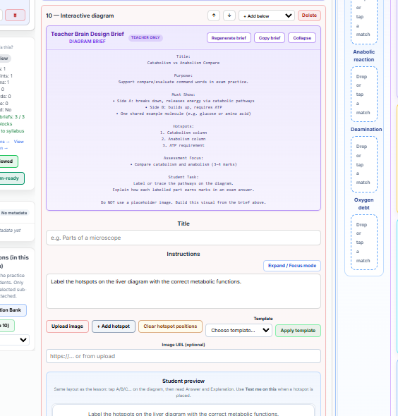
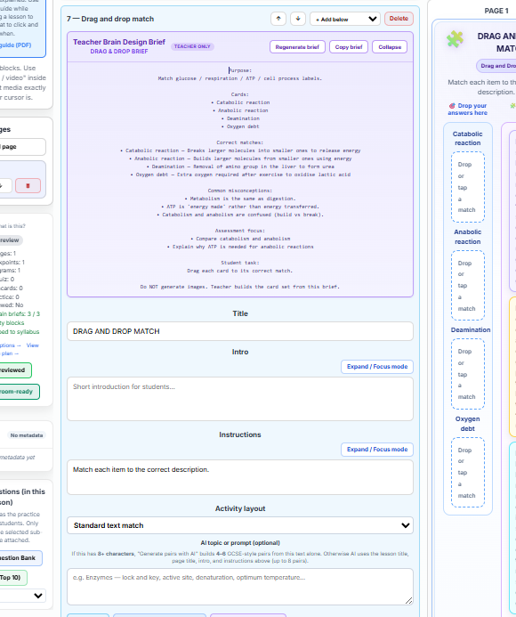
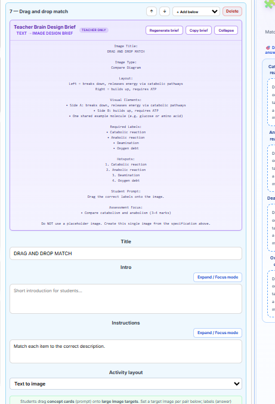
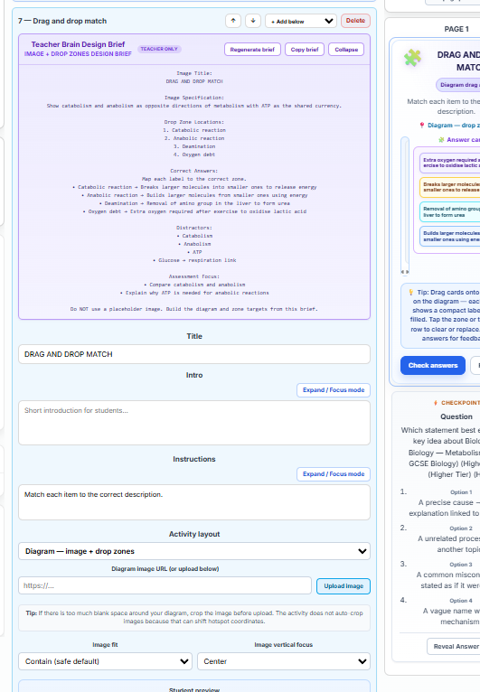

# Teacher Brain Phase 3 — UI regression screenshots

Reference captures for activity-aware design briefs (tag: `teacher-brain-phase3-complete`, commit `5bdc0ea1`).

**Edit Lesson layout (outside actions rail):** see [EDITOR_LAYOUT_REGRESSION.md](./EDITOR_LAYOUT_REGRESSION.md) (tag: `editor-layout-stable-2026-06`).

Use these when changing `lib/teacherBrain/diagramBriefInjector.js`, `pagesForTeacherBrainInjectionApi`, or `TeacherBrainDesignBriefPanel` to confirm layout detection and regenerate still work.

## Quick checklist

| Activity block | Activity layout (editor) | Expected panel subtitle | Screenshot |
| --- | --- | --- | --- |
| `interactiveDiagram` | (n/a — diagram block) | **DIAGRAM BRIEF** | [interactive-diagram-brief.png](./screenshots/interactive-diagram-brief.png) |
| `dragDropMatch` | Standard text match | **DRAG & DROP BRIEF** | [drag-drop-standard-text-match-brief.png](./screenshots/drag-drop-standard-text-match-brief.png) |
| `dragDropMatch` | Text to image | **TEXT → IMAGE DESIGN BRIEF** | [drag-drop-text-to-image-brief.png](./screenshots/drag-drop-text-to-image-brief.png) |
| `dragDropMatch` | Diagram — image + drop zones | **IMAGE + DROP ZONES DESIGN BRIEF** | [drag-drop-image-drop-zones-brief.png](./screenshots/drag-drop-image-drop-zones-brief.png) |

## What each reference shows

### 1. Interactive Diagram — DIAGRAM BRIEF

- Purple panel: **Teacher Brain Design Brief** / **DIAGRAM BRIEF**
- Brief includes Title, Purpose, Must Show, Hotspots, Assessment Focus, Student Task
- **Regenerate brief** visible in header

### 2. Drag & Drop — standard text match

- Activity layout: **Standard text match**
- Subtitle: **DRAG & DROP BRIEF**
- Sections: Purpose, Cards, Correct matches, Common misconceptions, Assessment focus, Student task
- Student preview: column match (cards + drop zones)

### 3. Drag & Drop — Text → Image

- Activity layout: **Text to image**
- Subtitle: **TEXT → IMAGE DESIGN BRIEF**
- Sections: Image Title, Image Type, Layout, Visual Elements, Required Labels, Hotspots, Student Prompt, Assessment Focus

### 4. Drag & Drop — Diagram → Image + Drop Zones

- Activity layout: **Diagram — image + drop zones**
- Subtitle: **IMAGE + DROP ZONES DESIGN BRIEF**
- Sections: Image Title, Image Specification, Drop Zone Locations, Correct Answers, Distractors, Assessment Focus
- Diagram image URL / upload controls visible below brief

## Manual regression steps

1. Open a Metabolism (or similar) lesson in **Edit Lesson**.
2. For each `dragDropMatch` block, set **Activity layout** as in the table above.
3. Click **Regenerate brief** (or lesson-level inject on first run).
4. Confirm the panel subtitle and section headings match the screenshot for that layout.
5. Change layout and regenerate again — brief type must update (not stay on the previous template).

## Automated tests (related)

- `tests/teacherBrain.diagramInjector.test.js` — layout → brief template
- `frontend/src/components/lesson/TeacherBrainDesignBriefPanel.test.tsx` — panel subtitle + regenerate button
- `frontend/src/utils/teacherBrainBriefPages.test.ts` — layout fields passed to injector API shape

## Captured

- **Date:** 2026-05-31
- **Lesson context:** Metabolism lesson, block 7 (drag drop) / block 10 (interactive diagram)
- **Branch:** `migration-audit-2026`
