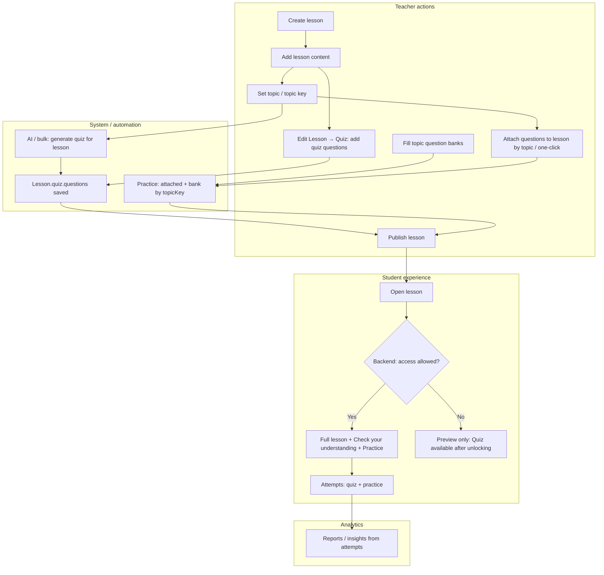

# Testing and Practice: Full Workflow for Teachers

This guide explains how **lesson quizzes**, **practice questions**, and **analytics** work in the platform—and how to set them up so students get a consistent experience.

---

## 1. The Two Question Systems (Clear Separation)

The platform has **two separate question systems**. They use different data, different teacher actions, and different student entry points. Keeping them distinct avoids confusion.

### Lesson Quiz — "Check your understanding"

- **What it is:** A short quiz that appears **inside the lesson** in a section titled **"Check your understanding"**.
- **Where it lives:** Stored on the **lesson itself** (the lesson's quiz questions).
- **Who sees it:** Students viewing that lesson, **only when they have full access** (see Access logic below).
- **Purpose:** Quick check that students understood the lesson content before moving on.

### Topic Question Banks (Practice / Analytics)

- **What it is:** A **topic-scoped bank** of practice questions. Students see these in the **Practice** section of a lesson (and in related analytics).
- **Where it lives:** In **question banks** linked to syllabus topics (e.g. "Cell structure", "Photosynthesis"). Lessons can either:
  - **Use attached questions** — questions you explicitly attach to that lesson from the bank, or  
  - **Pull from the bank by topic** — if the lesson is mapped to a topic, students can still "Try another set" from the bank even when the lesson has no attached questions.
- **Who sees it:** Students with **full access** to the lesson see the Practice section; the section is gated by the same access rules as the rest of the lesson.
- **Purpose:** Deeper practice and revision; feeds into progress and analytics.

**In short:**  
- **Lesson quiz** = "Check your understanding" inside the lesson, from the lesson's own quiz.  
- **Practice** = topic-based question banks (attached to the lesson and/or by topic).  
They are **not** the same. Empty quiz does not mean empty Practice, and vice versa.

---

## 2. Teacher Actions and Timing

### When you add **lesson quiz** questions ("Check your understanding")

- **Where:** **Edit Lesson → Quiz** (or equivalent quiz section in the lesson editor).
- **What you do:** Add or edit multiple-choice and/or short-answer questions. These are saved as the lesson's quiz and appear in "Check your understanding" when the student has full access.
- **When:** Anytime—when creating the lesson, or when revising it. You can also use **AI / generate** (see below) to create a first draft of quiz questions; you should still review and edit them in Edit Lesson → Quiz.

### When you add **practice** questions (banks / revision materials)

- **Where:**  
  - **Question banks** (e.g. Revision Materials / Exam Question Bank): you create or import questions and tag them with **subject, level, exam board, and topic** (and optionally a **topic key** so they match the syllabus).  
  - **Edit Lesson:** From the lesson edit screen you can **attach questions by topic** (e.g. "Attach 10 questions for this lesson's topic") so that this lesson's Practice section uses those questions. Some flows are named things like "one-click fix" or "attach by topic."
- **What you do:**  
  - Build the bank: add questions to the topic-scoped bank.  
  - Link to the lesson: either attach specific questions to the lesson, or ensure the lesson has a **topic (or topic key)** so the system can pull practice from the bank for that topic.
- **When:** Before students need practice—ideally when you finalise the lesson or when you build out a topic's bank.

### When questions are **generated automatically** (AI / bulk)

- **Lesson quiz:** The platform can **generate** quiz questions (and sometimes flashcards) from the lesson content and a **topic key**. This is an AI/bulk step that fills the lesson's quiz; you then **edit and refine** in Edit Lesson → Quiz. Generation usually requires the lesson to be mapped to a valid syllabus topic.
- **Practice:** Practice questions come from **banks**, not from the same AI that generates the lesson quiz. Attaching by topic or "one-click" flows **attach existing bank questions** to the lesson; they do not create new questions out of thin air. So "automatic" here means "automatically attach from the bank," not "generate new questions from AI" in the same way as the lesson quiz.

---

## 3. Student Experience Mapping

### What students see **inside the lesson**

- **Lesson content** (pages, text, diagrams, etc.).
- **"Check your understanding"** section:
  - If the student has **full access** and the lesson **has quiz questions**: they see the **lesson quiz** (multiple choice and/or short answer).
  - If the student **does not** have full access: they see a message like **"Quiz available after unlocking the full lesson."** They do **not** see the questions.
  - If the student has full access but the lesson has **no quiz questions**: they see a message like "No quiz questions generated for this topic yet."
- **Practice** section (if present): same as below—only when they have full access; content comes from attached questions and/or topic bank.

### What students see under **Practice**

- A **Practice** area (e.g. on the lesson page or a dedicated practice view) that shows:
  - Questions **attached to this lesson** from the bank, and/or  
  - Questions from the **topic bank** for the lesson's topic (e.g. "Try another set").
- This section is **only available when the student has full access** to the lesson. If they are in free preview or not entitled, they typically won't see practice questions for that lesson.

### When the quiz is **locked** vs **visible**

- **Visible:** Student has **full access** (subscription, purchase, admin pass, or owner/teacher). The backend sends "allowed" for the lesson, and the lesson page shows the full lesson plus "Check your understanding" (if there are quiz questions) and Practice (if configured).
- **Locked:** Student is in **free preview** or **not entitled**. The backend sends "not allowed" (e.g. reason: free preview). The lesson may show limited content (e.g. first page only), and "Check your understanding" shows **"Quiz available after unlocking the full lesson."** The actual quiz questions are not shown. Practice for that lesson is also gated.

---

## 4. Access Logic (Non-Technical, Teacher-Safe)

The system decides "full access" or "preview/locked" on the **server** when the student opens the lesson. That decision controls what content and which features they see.

### Free preview vs full access

- **Free preview:** The lesson is configured to allow a taster (e.g. first page only). The student is **not** given full access. They see:
  - Limited content (as configured), and  
  - **"Quiz available after unlocking the full lesson."** — no quiz, no practice for that lesson.
- **Full access:** The student is treated as entitled (see below). They see the full lesson, the lesson quiz (if any), and practice (if any).

### How a student gets full access

- **Subscription active** — they have an active subscription that includes the lesson.
- **Purchase** — they purchased that lesson.
- **Admin pass** — a special pass (e.g. for staff or pilot) grants full access.
- **Owner / teacher** — you, as the teacher, always have full access to your own lessons when logged in.

If the server says **allowed = true**, the student gets full access. If it says **allowed = false** (e.g. free preview or not entitled), the student sees the locked experience.

### Why a quiz might show "available after unlocking"

- The student is in **free preview** for that lesson, or  
- The student is **not entitled** (no subscription, no purchase, no admin pass).  

So the message is correct: the quiz (and full lesson + practice) are available **after** they unlock the full lesson (by subscribing, purchasing, or using an admin pass). The platform does not show the questions until then.

---

## 5. Common Failure Modes (With Explanations)

### "Check your understanding is empty"

- **Cause 1:** The lesson has **no quiz questions** stored. The lesson quiz is read from the lesson's own quiz list. If you never added questions (or never ran generation and then saved), the list is empty.
- **Fix:** In **Edit Lesson → Quiz**, add or generate quiz questions and save. If you use AI generation, ensure the lesson is mapped to a valid topic and that you save the generated quiz to the lesson.

### "Practice questions are empty"

- **Cause 1:** The lesson has **no questions attached** and/or **no topic (topic key)** so the system cannot pull from a bank.
- **Cause 2:** The **topic bank** for that topic has no questions yet.
- **Cause 3:** The student **does not have full access**; practice is hidden for free-preview or non-entitled users.
- **Fix:** Map the lesson to a syllabus topic (topic key). Add questions to the **topic question bank** for that topic. Optionally **attach** questions to the lesson (e.g. "attach by topic" or "one-click" from the lesson edit or reports). Ensure the student has full access when testing.

### "Analytics show no data"

- **Cause 1:** No (or very few) students have **full access** and have not attempted the lesson quiz or practice yet.
- **Cause 2:** Analytics are driven by **attempts** (quiz attempts, practice attempts). If students only view the lesson and don't submit the quiz or practice, there is little to show.
- **Cause 3:** The lesson or topic was recently set up; it takes time for students to complete work and for data to appear.
- **Fix:** Confirm students are entitled and actually doing the quiz/practice. Give it some time after go-live. If you use reports/insights, ensure they are scoped to the right lesson and time range.

---

## 6. Recommended Teacher Checklist

**Minimum viable setup per lesson (and topic):**

1. **Lesson content** — Create and save your lesson (pages, text, etc.).
2. **Topic mapping** — Set the lesson's **topic** (and topic key if your system uses it) so it matches the syllabus. This is needed for practice (and often for quiz generation).
3. **Lesson quiz** — In **Edit Lesson → Quiz**, add at least a few "Check your understanding" questions (or run AI generation, then review and save). Without this, students with full access will see "No quiz questions generated for this topic yet."
4. **Practice** — Either:
   - Add questions to the **topic question bank** for that topic, and optionally **attach** some to the lesson (e.g. attach by topic), or  
   - Rely on "Try another set" from the bank if the lesson is mapped to a topic that already has bank questions.
5. **Access** — Publish the lesson and ensure your access rules (free preview vs full) match how you want students to see the quiz and practice.
6. **Quick check** — Open the lesson as a student (or with a test account without full access) and confirm:  
   - With full access: quiz and practice appear.  
   - Without full access: you see "Quiz available after unlocking the full lesson." and no quiz/practice.

---

## 7. Flow Diagram (Overview)

The diagram below summarises the flow from **teacher creating a lesson** through **student lesson and practice** to **analytics**. Use it as a shared mental model with your team.

**In words:**

- Teacher creates the lesson, adds content, adds quiz in Edit Lesson → Quiz (or generates and saves), and sets topic/topic key.
- Teacher fills topic question banks and can attach questions to the lesson (e.g. by topic or one-click).
- The lesson stores its own quiz. Practice uses attached questions and/or topic-scoped banks.
- When the student opens the lesson, the **backend** decides access. If allowed, they see the full lesson, "Check your understanding," and Practice. If not (e.g. free preview), they see the "Quiz available after unlocking" message.
- Student attempts (quiz and practice) feed into analytics and reports.

---

This document describes the **current system**: lesson quiz from the lesson's quiz, practice from topic-scoped banks (and attached questions), and access controlled by the backend. Use it as the single source of truth for teacher onboarding, support, and product/engineering alignment.
